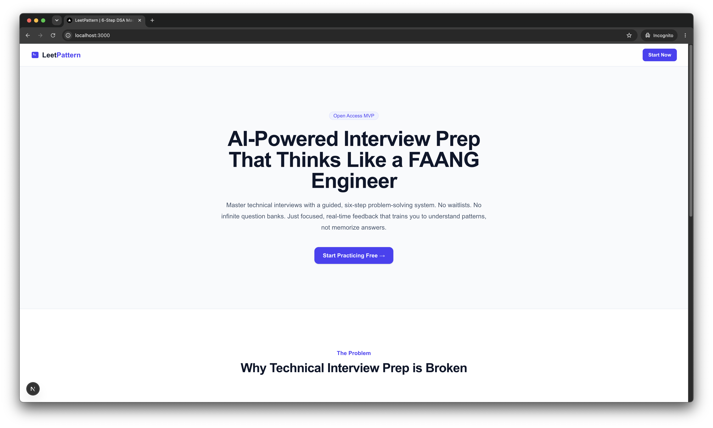
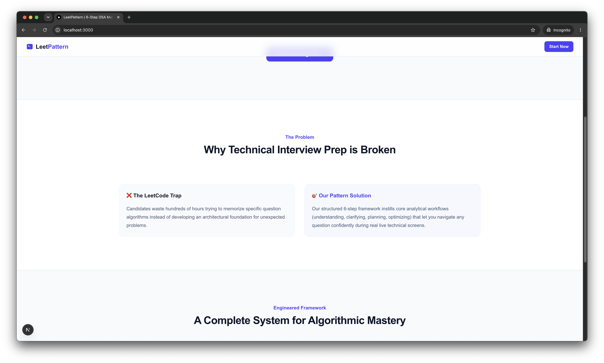
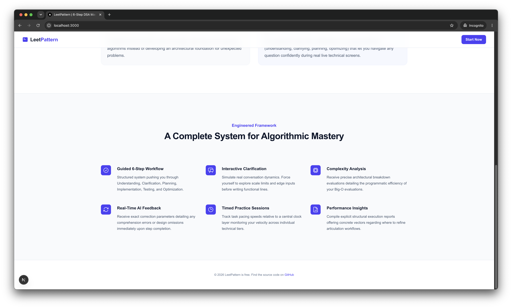
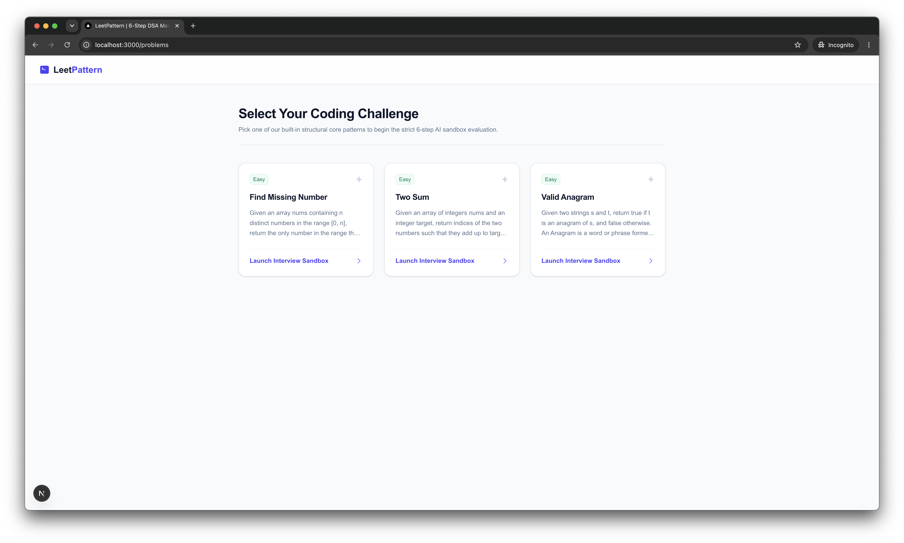
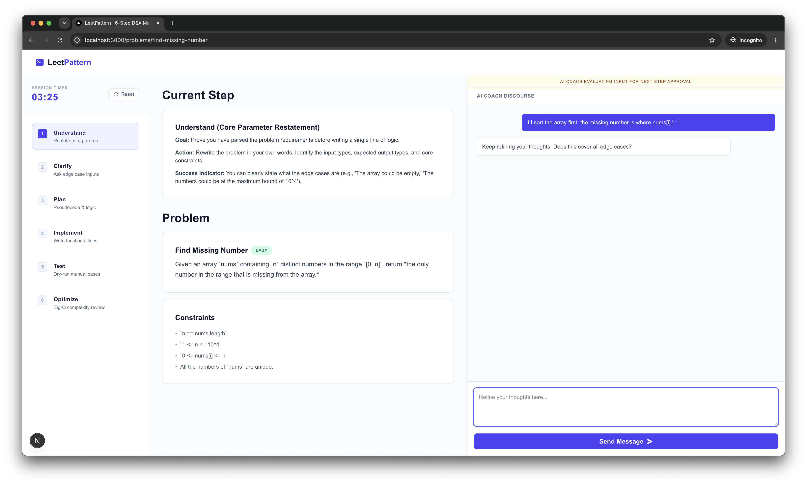
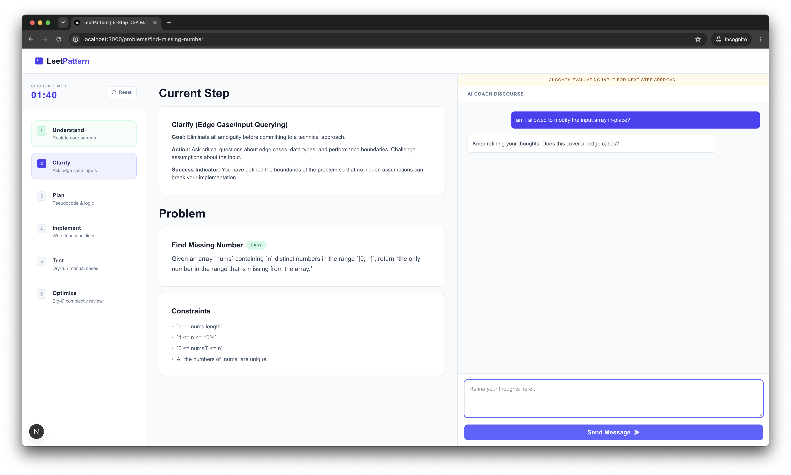
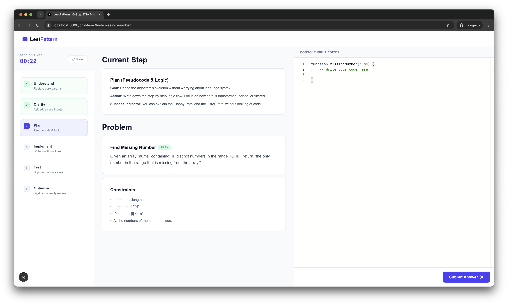
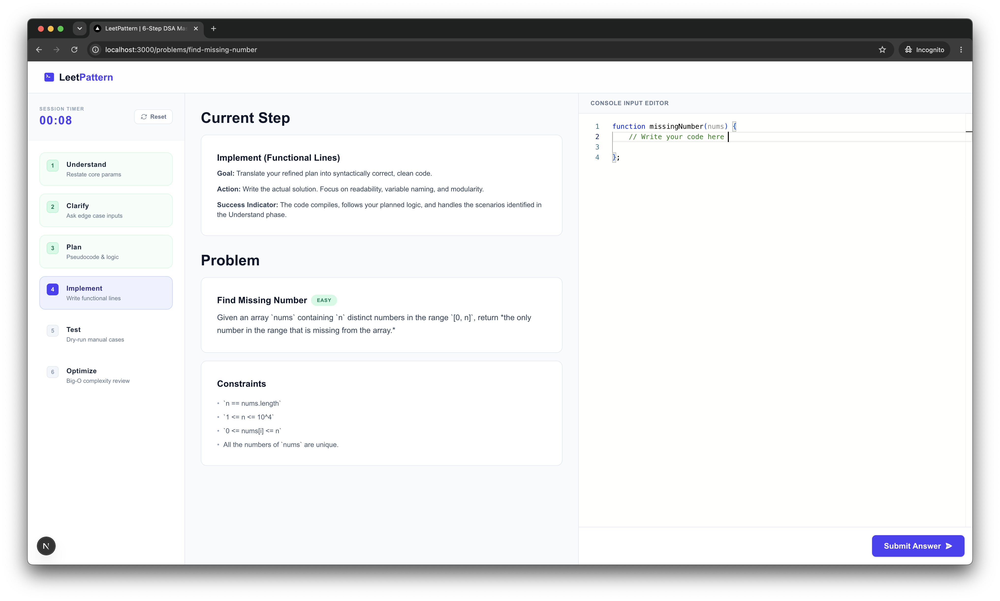
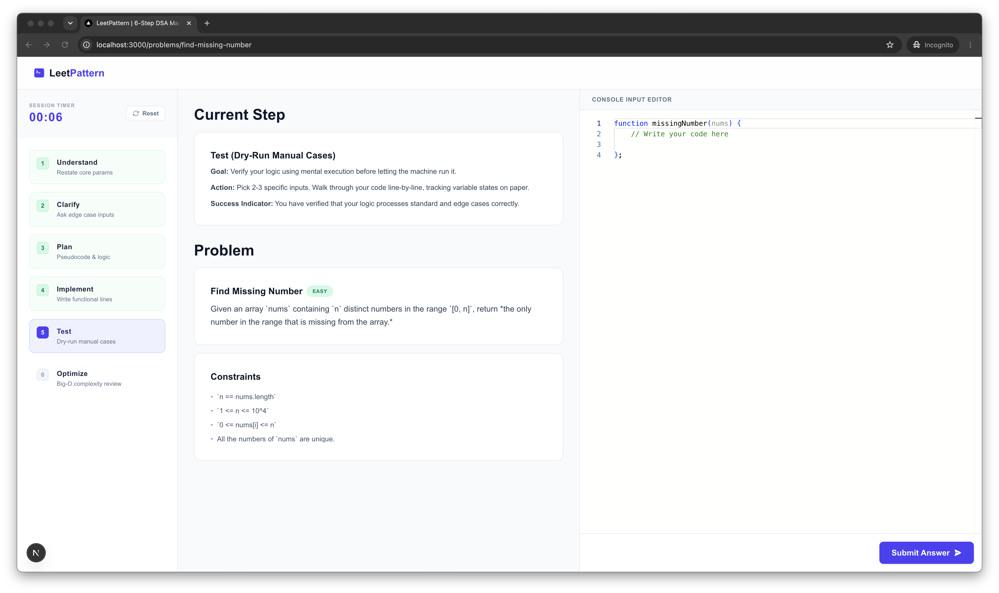
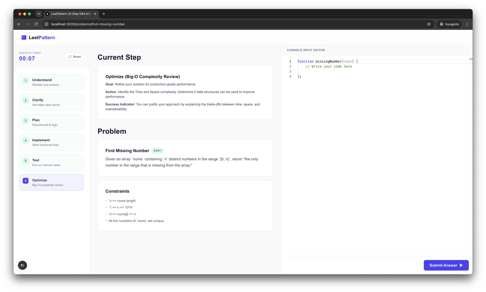

# LeetPattern

An AI-powered technical interview training platform that teaches engineers **how to solve problems**, not just memorize solutions.

LeetPattern guides users through a structured 6-step interview framework used in real software engineering interviews. Instead of jumping directly into coding, users must first demonstrate understanding, clarify requirements, plan an approach, test their reasoning, and analyze complexity before completing a challenge.

---

## Why I Built This

While preparing for technical interviews, I noticed that most platforms focus heavily on solving large volumes of coding problems.

Although that helps build familiarity with common patterns, it often encourages memorization rather than the structured thinking expected during real interviews.

In actual interviews, candidates are evaluated on far more than whether their code passes test cases. Interviewers want to understand how candidates:

- Break down requirements
- Identify ambiguities
- Discuss tradeoffs
- Design solutions
- Validate assumptions
- Analyze complexity

I built LeetPattern to enforce this workflow and provide AI-guided feedback throughout the process.

---

## Key Features

### Structured 6-Step Interview Workflow

Users progress through the same stages commonly used in technical interviews:

1. **Understand** — Restate the problem in your own words
2. **Clarify** — Ask questions about constraints and edge cases
3. **Plan** — Design an algorithm before writing code
4. **Implement** — Build the solution
5. **Test** — Dry-run and validate behavior
6. **Optimize** — Analyze time and space complexity

The platform intentionally prevents users from skipping ahead before completing earlier phases.

---

### AI-Guided Evaluation

Each stage is evaluated independently using Google Gemini.

Examples include:

- Comprehension scoring during the Understand phase
- Constraint and edge-case discussions during Clarify
- Algorithm validation during Plan
- Complexity analysis during Optimize

The AI acts as a coaching layer rather than a solution generator.

---

### Dynamic Workspace Experience

The interface changes based on the user's current phase.

**Discovery Phase (Steps 1–2)**

- Conversational workspace
- Problem understanding
- Clarification discussions
- No code editor visible

**Execution Phase (Steps 3–6)**

- Planning interface
- Monaco code editor
- Testing tools
- Complexity analysis workflow

This encourages users to think before they code.

---

## Screenshots

### Landing Page







---

### Challenge Dashboard



---

### Interview Workspace

#### Step 1 — Understand



#### Step 2 — Clarify



#### Step 3 — Plan



#### Step 4 — Implement



#### Step 5 — Test



#### Step 6 — Optimize



---

## Tech Stack

### Frontend

- Next.js (App Router)
- TypeScript
- Tailwind CSS
- Monaco Editor

### Backend

- Next.js API Routes
- Prisma ORM
- SQLite

### AI

- Google Gemini API
- Custom evaluation prompts
- Step-specific coaching logic

---

## Architecture

```text
+---------------------------------------+
|           Browser (Client)            |
| (Tracks session via localStorage UUID)|
+---------------------------------------+
           /         |         \
          /          |          \
         v           v           v

+--------------------------------------------------+
|              Next.js App Router                  |
+--------------------------------------------------+
|                                                  |
|  Problem Pages          AI Evaluation API        |
|                                                  |
+--------------------------------------------------+
           |                       |
           v                       v

+------------------+     +------------------+
| Prisma + SQLite  |     |   Gemini API     |
+------------------+     +------------------+
```

### Session Architecture

To keep the MVP lightweight, the platform does not require authentication.

Instead:

- A unique session ID is generated in the browser
- Session state is persisted in SQLite
- Progress is restored automatically
- Users can continue where they left off without creating an account

---

## Technical Challenges

### Enforcing a Sequential Workflow

A core requirement was preventing users from skipping directly to implementation.

The application uses a step-based state machine that controls:

- Available UI components
- API evaluation logic
- Database state transitions
- Progress persistence

Each phase must be completed before the next becomes available.

---

### AI Evaluation Pipeline

The backend dynamically constructs prompts based on:

- Current interview phase
- Problem context
- Previous user responses
- Session history

This allows the AI coach to provide targeted feedback while maintaining continuity across the entire interview session.

---

### Dynamic Interface Rendering

The workspace transitions between conversational and coding environments depending on the user's progress.

This required:

- Centralized session management
- Conditional component orchestration
- Persistent synchronization between client and database state

---

## Repository Structure

```text
app/
├── api/
│   ├── ai/
│   └── session/
├── problems/
│   └── [slug]/

components/
├── workspace/
├── StepTracker.tsx
└── TopNav.tsx

context/
└── InterviewContext.tsx

prisma/
├── schema.prisma
├── seed.ts
└── dev.db
```

---

## Running Locally

### 1. Clone the Repository

```bash
git clone https://github.com/iorrah/leetpattern.git
cd leetpattern
```

### 2. Install Dependencies

```bash
pnpm install
```

### 3. Configure Environment Variables

Create a `.env.local` file:

```env
DATABASE_URL="file:./prisma/dev.db"
GEMINI_API_KEY=your_api_key
```

---

### 4. Initialize the Database

```bash
npx prisma db push
npx prisma db seed
```

---

### 5. Start the Development Server

```bash
pnpm dev
```

Open:

```text
http://localhost:3000
```

---

## Future Improvements

Planned enhancements include:

- Voice-based interview practice
- Expanded challenge library
- Interview performance analytics
- Multi-language support
- Real-time collaborative mock interviews
- Adaptive difficulty recommendations

---

## Lessons Learned

Building LeetPattern reinforced several engineering concepts:

- Designing state-driven user experiences
- Building AI evaluation pipelines
- Managing conversational context across sessions
- Creating dynamic interfaces that evolve with user progress
- Balancing AI assistance without giving away solutions

---

## License

This project is licensed under the MIT License.
